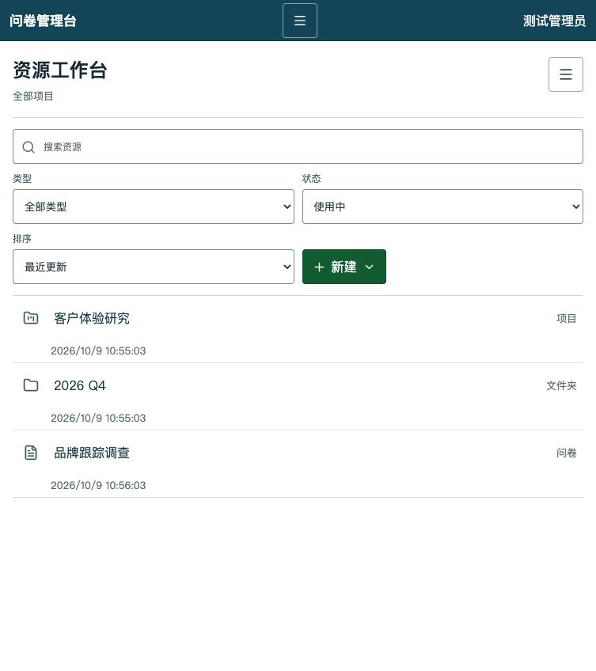
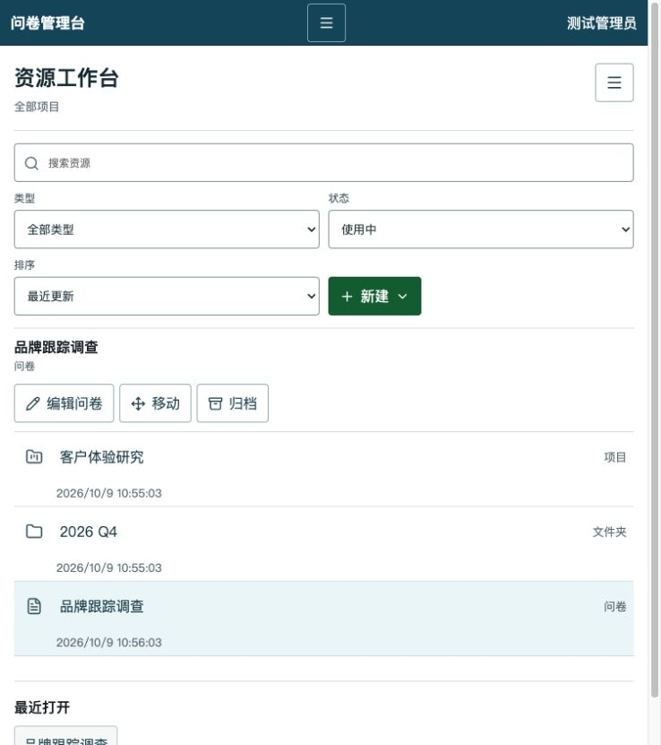
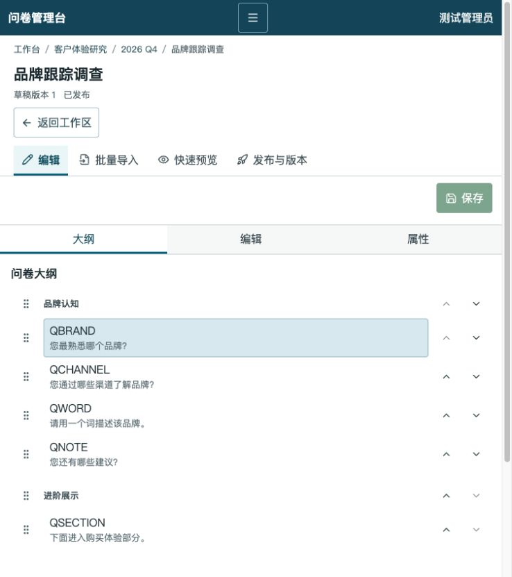
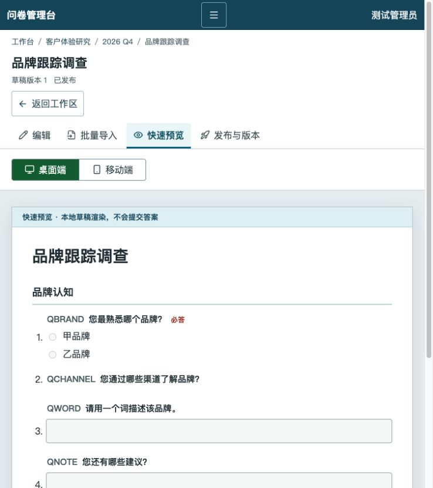
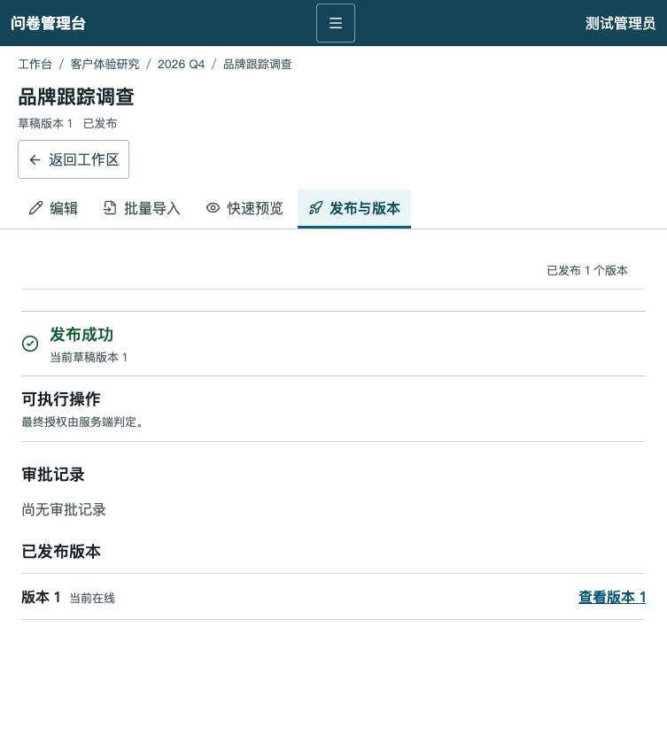

# 问卷平台全量开发核查报告

日期：2026-10-09

核查基线：`feat/admin-product-alignment` @ `f0a3ff9b`

核查范围：当前真实页面、React 管理端、Java 平台服务、发布网关、LimeSurvey 插件与主题、数据库迁移、端到端测试、设计蓝图、需求矩阵和进度文档。

## 1. 执行结论

### 1.1 直接回答

并不是只开发了当前工作台这一页。仓库中已经形成了较厚的平台后端、发布适配层、引擎插件、题型主题和测试体系；当前页面只暴露了其中很小的一部分。

真正的问题是：**工程建设量较大，但产品化率和用户可见率很低。**

- 后端有 14 个主要领域包、558 个主代码类、39 个 Controller、约 156 个 HTTP 映射方法和 46 个数据库迁移。
- React 管理端只有 6 个功能目录，业务主导航只有“工作台、问卷”两个入口，主要覆盖资源、基础编辑、批量导入、快速预览、发布和版本。
- 按粗略接口口径，前端约 29 个 API 调用点，对应后端约 156 个映射方法。这个比例不能作为精确覆盖率，但足以说明前后端能力严重失衡。
- 蓝图冻结了 305 条需求；仓库实证文档当前认定 13 条完整达成、86 条部分完成、191 条未开始、15 条等待外部输入，完整达成率约 4.3%。
- 最近交付的 Phase A+B 主要解决演示环境、资源工作区和导航上下文，没有交付模板、品牌配置、响应数据、投放、通讯录、高级题型配置或真实运行时预览。

因此，用户看到的产品确实不足以体现已经投入的工程工作。问题不在“完全没有代码”，而在“后端能力没有被组织成完整、可发现、可操作、可演示的产品”。

### 1.2 当前成熟度判断

| 维度 | 判断 | 说明 |
|---|---|---|
| 技术底座 | 较强 | 租户、权限、发布、事件、计量、访问规则等已有较完整测试 |
| 后端业务能力 | 中等偏强 | 多领域接口已存在，但若干模块仍是局部切片或测试替身 |
| 前端产品能力 | 偏弱 | 只形成作者创作纵切，绝大多数后端能力没有页面 |
| 视觉与交互成熟度 | 偏弱 | 基础可用，但信息密度、操作引导和产品层级仍像工程控制台 |
| 真实业务闭环 | 很弱 | 缺模板、品牌、真实预览、分发、回收、数据分析等连续旅程 |
| 生产就绪度 | 未达到 | 生产部署、TLS 实证、多副本、安全缺口和供应链门禁未闭环 |

## 2. 代码资产盘点

以下数据用于说明实际工程规模，不等同于需求完成度。

| 代码区域 | 规模 | 主要作用 |
|---|---:|---|
| `platform/services/business/src/main/java` | 约 39,530 行 | Java 平台业务与控制面 |
| `platform/services/business/src/test/java` | 约 32,158 行 | 平台单元和集成测试 |
| `platform/tools/publish-gateway` | 约 26,336 行 | 问卷编译、发布和引擎适配 |
| `plugins` | 约 17,258 行 | 引擎事件、运行策略、题型扩展 |
| `platform/tests/e2e` | 约 13,678 行 | 真实引擎和平台纵向验收 |
| `platform/apps/admin-web/src` | 约 12,249 行 | React 管理端及组件测试 |

当前分支相对 `main`：72 个提交、159 个文件、约新增 27,028 行。Phase A+B 相对 PR #10 基线：19 个提交、91 个文件、约新增 8,514 行、删除 1,026 行。自 2026-09-18 起，`platform/` 路径累计约 289 个提交。

这些数字证明开发工作并不少，也同时说明投入主要沉淀在平台机制、测试和基础设施中，而不是大量产品页面。

## 3. 后端完成情况

### 3.1 已形成的主要领域

| 领域 | 已有代码能力 | 产品状态 |
|---|---|---|
| 租户、套餐与计量 | 租户生命周期、套餐版本、订阅、席位、额度预留与结算 | 后端存在，管理端无运营页面 |
| 身份与组织登录 | 身份绑定、企微/钉钉/飞书连接、登录交接、事件同步 | 登录链路可见，连接管理不可见 |
| 资源与权限 | 项目/文件夹/问卷、授权继承、能力判定、移动、归档恢复 | 工作区已接入 |
| 问卷定义 | 草稿、乐观锁、导入预览、保存、版本恢复 | 基础编辑已接入 |
| 审批与发布 | 审批申请、批准/驳回/撤回、发布、版本、漂移检查 | 问卷内页面已接入 |
| 模板库 | 租户模板、平台模板、版本、审核、复制、下架 | 无前端入口 |
| 访问策略 | 密码、邀请码、时间窗、限次、验证码、IP/地区规则 | 无配置页面 |
| 题型扩展 | 15 套题型主题、服务端校验、扩展表结构 | 管理端仅只读保真，不可视化配置 |
| 投放触达 | 链接、二维码、短链、嵌入、批量任务、回执、退订、催答 | 无前端入口；真实通道未接入 |
| 答卷与导出 | 跨版本查询、字段字典、脱敏、CSV/XLSX/SAV/DOCX/附件作业 | 无前端入口 |
| 通讯录 | 联系人、部门、标签、名单导入、参与登记、数据范围 | 无前端入口 |
| 资产 | 上传、版本、归档、作答者素材访问 | 无前端入口 |
| 字典 | 平台字典、版本、节点、发布和查询 | 无前端入口 |
| 引擎事件 | HMAC 事件、Inbox/Outbox、答卷投影、补偿扫描 | 内部机制，不应直接显示给用户 |

### 3.2 后端的真实价值

后端工作不是无效开发。它解决了多租户隔离、权限裁决、发布原子性、事件可靠性、访问控制、导出恢复、题型服务端校验等高风险问题。这些能力如果后补，容易造成数据泄露、版本错乱和发布事故。

但当前交付方式有明显失衡：大量能力只有 Controller、Service、迁移和自动化测试，没有业务页面、导航入口、演示数据和用户验收路径。因此它们只能算“工程能力”，不能算“已交付产品能力”。

### 3.3 后端未完成与风险

- 事务性发件箱已有生产者但消费者和死信闭环不完整。
- 发布网关限流和并发锁仍是进程内实现，多副本部署受限。
- 导出和资产存储仍偏单机，本地文件实现阻塞多副本。
- 真实短信、邮件和三家组织平台仍需凭据及生产适配。
- 生产部署路径、TLS、mTLS、制品签名、漏洞扫描尚未闭环。
- 已记录的高风险包括附件保护依赖 `.htaccess`、RemoteControl 绕过运行闸门、邀请码撤销未同步引擎。

## 4. 前端完成情况

### 4.1 当前可见页面

当前 React 管理端实际形成的用户路径为：

1. 登录交接或本地开发登录。
2. 工作区浏览、搜索、筛选、排序和创建资源。
3. 资源改名、移动、归档和恢复。
4. 基础题型编辑、题组/题目排序和草稿保存。
5. 批量文本导入预览与确认。
6. 本地草稿快速预览。
7. 发布审批、发布状态和不可变版本查看。

基础题型编辑覆盖说明文字、单选、多选、短文本和长文本。复杂题型能够只读展示并无损往返，但没有可视化配置器。

### 4.2 当前真实页面审计

#### Step 1：资源工作台

健康度：**基本可用，但产品价值表达很弱。**

搜索、类型、状态、排序和新建已经可操作，测试数据也已与人工演示隔离。但页面只展示三个资源，没有总览、待办、状态摘要、数据量或下一步提示；全局导航只有两个入口，用户无法发现后端已经存在的模板、投放、通讯录、导出等能力。

#### Step 2：资源选中与操作

健康度：**操作闭环存在，交互仍偏工程化。**

选中后可编辑、移动、归档，并记录最近打开。问题是操作区与列表关系松散，当前层级仍同时展示项目、文件夹和问卷，缺少更明确的业务工作区层级。

#### Step 3：问卷编辑

健康度：**基础作者链路可用，尚不是成熟编辑器。**

已有面包屑、问卷状态、流程页签、排序和窄屏大纲/编辑/属性标签。当前窄屏首屏只看到大纲，真正的编辑区要再次切换；没有题型面板、逻辑编排、品牌配置、访问策略或高级题型配置。

#### Step 4：批量导入

健康度：**功能存在，但只是文本工具。**

支持预览和逐行错误，但页面没有格式示例、模板下载、历史任务、批次状态或导入结果摘要。

#### Step 5：快速预览

健康度：**标识诚实，但能力有限。**

页面已明确说明是本地草稿渲染且不提交答案。它不能证明 LimeSurvey 真实题型主题、运行策略、品牌和响应式答卷行为。

#### Step 6：发布与版本

健康度：**状态可读，但闭环不完整。**

可以看到发布结果、审批记录和版本详情，但没有直接的真实预览入口、答卷链接、二维码、回收状态、答卷数量或导出入口。发布成功后用户仍不知道下一步应做什么。

### 4.3 没有前端入口的主要后端能力

| 能力 | 后端 | 前端 |
|---|---|---|
| 模板库与平台模板 | 已有完整生命周期接口 | 无路由、无导航 |
| 全局待审批 | 已有 pending API | 只有单问卷内审批 |
| 答卷列表、摘要、字段 | 已有查询 API | 无页面 |
| 导出任务和下载 | 已有作业 API | 无页面 |
| 投放链接、二维码、短链 | 已有 API | 无页面 |
| 批量发送、回执、催答 | 已有 API | 无页面 |
| 通讯录、部门、标签、名单 | 已有 API | 无页面 |
| 品牌与多语言 | 有主题和契约 | 无配置页面 |
| 访问规则 | 有后端和真实引擎测试 | 无配置页面 |
| 资产库与字典 | 已有 API | 无页面 |
| 租户、套餐、引擎实例 | 已有运营接口 | 无运营后台 |

## 5. 蓝图与进度对比

### 5.1 阶段口径

| 阶段 | 蓝图目标 | 当前判定 |
|---|---|---|
| P0 基线与可行性 | 引擎、许可、题型、事件、隔离、发布可行性 | 工程切片完成；供应商与法务仍有外部项 |
| P1 租户与平台骨架 | 租户、身份、权限、套餐、计量、最小纵切 | 工程闸门已通过 |
| P2 通用问卷与本土入口 | 创建、题型、逻辑、访问、投放、数据、通讯录、品牌 | 进行中；后端主干较多，产品入口不足 |
| P3 商业业务 | 考试、测评、投票、表单、支付、预约、签署 | 仅考试/测评部分起步 |
| P4 研究、组织与 AI | 统计、研究、360、体验、AI、样本 | 基本未开始 |
| P5 全量交付 | SaaS、私有化、信创、海外、灾备、认证 | 未开始 |

### 5.2 305 条需求验收口径

| 状态 | 数量 | 比例 |
|---|---:|---:|
| 完整达成 | 13 | 4.3% |
| 部分完成 | 86 | 28.2% |
| 未开始 | 191 | 62.6% |
| 等待外部输入 | 15 | 4.9% |

这里的 4.3% 很低，但比“工程切片完成”更接近产品真实状态。复合需求只有全部子断言满足才能计为达成；后端机制、测试或某一个子功能存在，都不能把整条需求标绿。

### 5.3 管理端产品对齐计划

| 阶段 | 计划内容 | 实际状态 |
|---|---|---|
| Phase A | demo/E2E 隔离、固定数据、SSL 策略、引擎入口边界 | 已完成 |
| Phase B | AppShell、SurveyShell、资源排序搜索、归档、上下文恢复 | 已完成 |
| Phase C | 编辑器产品化、中间断点布局、中文文案、专项无障碍 | 未完成 |
| Phase D | 真实运行时预览、模板、品牌、高级题型 | 未完成 |

设计成功标准要求至少一项模板、品牌或高级题型形成“配置 → 真实预览 → 发布 → 作答”的可见闭环。当前 demo 已在后端种入 `zh-business` 品牌参数和一个折叠主题，并成功发布到真实引擎，但管理端没有品牌/高级题型配置入口，也没有从发布页进入真实答卷的链接，因此这一成功标准仍未满足。

### 5.4 文档漂移

- `04-开发方案总蓝图（仓库校准版）.md` 仍以 `main @ d84c271d`、PR #8/#9 为当前状态，没有吸收 PR #10/#11 的最终事实。
- `08-需求进度与方案修订（仓库实证）.md` 记录到 PR #10，尚未按 Phase A+B 重新逐条判定 305 条需求。
- 仓库 `platform/docs/p2/progress.md` 已记录 Phase A+B，但工程切片与 Accepted 需求仍是两套口径。
- 因此后续不能直接用 README 的工作包勾选率代表产品完成率。

## 6. 为什么开发很多但页面很少

1. **路线先做高风险底座。** 前期优先验证租户隔离、发布回滚、事件可靠性、访问策略和复杂题型，这些工作必要但不直接产生页面。
2. **前端启动较晚。** React 管理端是在大量后端模块完成后才建立，当前只接了作者纵切。
3. **按工程切片汇报放大了完成感。** “WP-01 ✅”代表若干切片有代码和测试，不代表 R01 的九条需求全部通过。
4. **质量门禁投入很重。** 大量代码用于真实栈、脱敏证据、失败清理、并发和负面测试，提升了可靠性，但没有增加菜单数量。
5. **演示设计太窄。** 当前 demo 只用一个项目、文件夹和问卷证明纵向链路，没有承担“展示整个平台能力”的职责。
6. **为避免空壳入口，导航隐藏了未接页面。** 这个决策本身合理，但也使大量已存在的后端能力完全不可发现。

## 7. 关键问题排序

### P0：产品交付口径失真

工程完成、自动化通过和用户可见经常被混合描述。下一轮必须对每个能力同时列出后端、前端、真实流程和验收状态。

### P0：安全问题阻塞生产

附件访问保护、RemoteControl 旁路、邀请码撤销同步是生产前必须关闭的问题。不能因为本地演示可运行就宣称生产可用。

### P1：缺少用户价值闭环

发布之后没有投放、答卷、统计和导出；模板、品牌和高级题型也没有从配置走到真实作答。当前产品更像“问卷作者原型”，不是完整问卷平台。

### P1：后端能力没有产品化

模板、通讯录、投放、数据、资产、字典、套餐等已经投入开发，但全部缺管理端入口，是当前最高的沉没价值。

### P2：编辑器仍是基础版本

题型创建面板、逻辑配置、访问策略、品牌、实时状态、真正的平板布局和读屏专项仍未完成。

## 8. 建议后续开发顺序

后续不应继续按“再补一个后端模块”推进，而应按可演示的纵向产品闭环推进。

1. **发布后闭环**：发布页增加真实预览、答卷链接、二维码、回收状态、答卷数量和导出入口。
2. **模板与品牌闭环**：模板列表/复制、品牌配置、真实运行时预览、发布、作答一次贯通。
3. **数据闭环**：答卷列表、筛选、摘要、导出任务、下载和权限提示。
4. **投放闭环**：联系人/名单、投放链接、批量任务、发送状态、催答和退订。
5. **编辑器 Phase C**：题型面板、中文题型名、820–1179px 布局、状态反馈和专项无障碍。
6. **高级题型第一批**：优先选择已有后端和主题最成熟的折叠栏目、多级下拉、轮播图，形成真正可配置的三条纵切。
7. **运营后台**：租户、套餐、引擎实例、组织连接和平台模板管理。
8. **生产安全与部署**：关闭高风险缺口，补多副本、对象存储、TLS 实证、签名和漏洞扫描。

每一项都应同时满足四个条件后再标记完成：页面可发现、真实接口联调、真实用户流程通过、需求断言更新。

## 9. 最终判断

当前成果不是“只做了一页”，而是“做了一个较大的后端平台和一条较窄的作者前端”。从工程角度看，基础并不薄；从用户角度看，产品确实显得薄，而且这个判断比提交数量更重要。

Phase A+B 达到了它们自己的限定目标，但不足以回应“完整本土化问卷产品”的期待。下一阶段最重要的不是继续扩充隐藏能力，而是把已有后端能力变成模板、品牌、真实预览、投放、答卷和导出的连续产品体验。

## 10. 核查边界

- 本轮实际打开并截图核查了工作区、资源操作、编辑、导入、快速预览、发布与版本。
- 代码规模来自当前工作树的文件与行数统计，包含测试代码，不代表功能完成率。
- API 数量来自 Spring Mapping 注解和前端 API 调用点的静态计数，只用于识别能力失衡。
- 305 条需求状态沿用 `08-需求进度与方案修订（仓库实证）.md` 的逐条核查结果；Phase A+B 尚未触发完整矩阵重判。
- 截图不能证明完整 WCAG 合规、真实性能、生产安全或多浏览器兼容。
