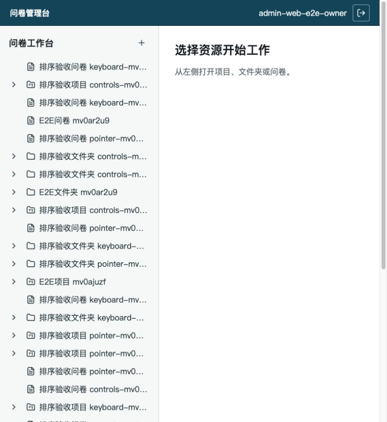
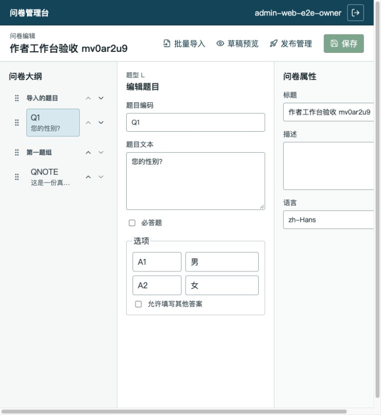
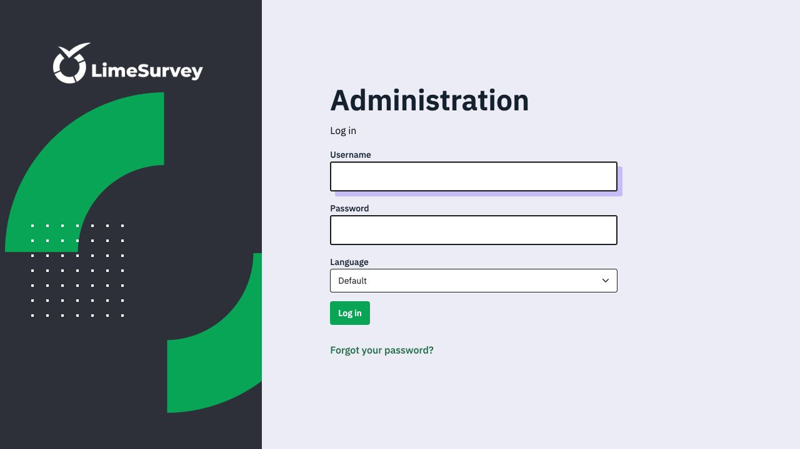
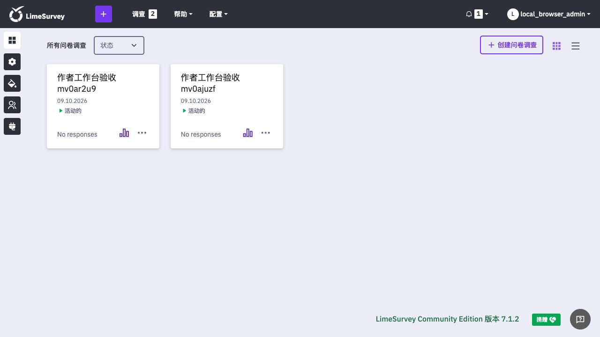
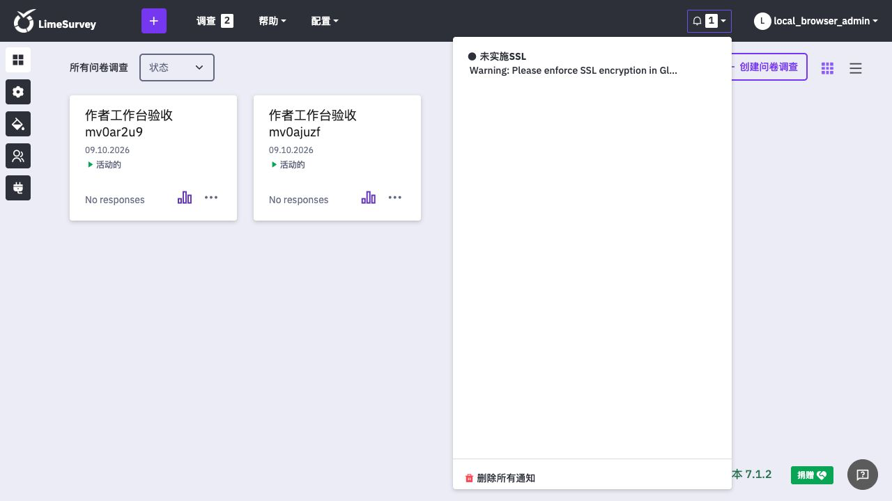
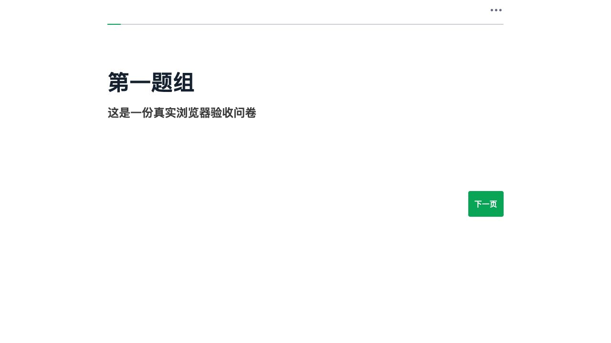

# 产品界面与蓝图对齐审计

> 最新全量开发核查见 [14-full-development-report.md](14-full-development-report.md)。该报告在 Phase A+B 完成后重新核对当前真实页面、前后端代码规模、305 条需求口径及后续产品化优先级。

日期：2026-10-09

核查对象：管理端作者工作台、LimeSurvey 引擎后台、真实答卷端、蓝图与实施计划

证据原则：区分“代码存在”“自动化通过”“真实用户可见”，不把三者混为一谈。

## 1. 总结

当前工程已经完成一条可运行的创建、编辑、审批、发布纵向链路，但仍是“工程纵切”，不是成熟产品界面。用户反馈成立：

1. 管理端工作区把资源树同时当作全局导航和内容列表，没有搜索、视图切换、状态过滤、最近使用或测试数据隔离；根节点又按随机 UUID 排序，因此视觉上没有业务规律。
2. LimeSurvey `/admin` 是原生引擎运维后台，当前分支没有后台主题或登录页品牌改造。自研工作主要位于独立 React 管理端、答卷主题、题型主题、插件和平台服务，不会自然改变 `/admin` 外观。
3. `zh-business` 已在真实答卷端生效，但当前演示数据没有租户 Logo、页脚等品牌参数，因此第一视觉仍偏通用。
4. 本地 HTTP 环境出现 SSL 提醒符合 LimeSurvey 默认行为。生产应在反向代理配置 TLS 后启用 `force_ssl`；本地测试环境应设置 `ssl_disable_alert=true`，不能假装本地 HTTP 已加密。
5. 蓝图要求的“最终一致可视编辑体验”尚未完成。高级题型配置、真实运行时预览、模板库、品牌设置、资源治理和专门无障碍审计仍未进入管理端。

## 2. 真实流程截图

### Step 1：管理端工作区

健康度：**差，需要优先重构。**

- 优点：项目、文件夹、问卷类型图标可辨识；权限驱动的新建按钮和 URL 选中状态已存在。
- 问题：自动化产生的资源与人工资源混在同一根层级；名称带运行后缀；排序无业务意义；主区空置，无法帮助用户扫描、筛选和恢复工作。
- 无障碍风险：列表项名称被截断后没有可见补充信息；重复相似名称会让键盘和读屏用户难以确认当前对象。

### Step 2：问卷编辑器

健康度：**基本流程可用，布局与产品层级不足。**

- 优点：大纲、编辑区、属性区职责明确；保存、导入、预览、发布入口存在；排序提供 pointer、keyboard 和显式按钮三条路径。
- 问题：在 768px 宽度仍渲染三栏，页面产生横向滚动；问卷属性长期占据右栏但内容很少；题型只显示裸值 `L`；缺少返回工作区、面包屑、问卷状态、最近保存时间和版本上下文。
- 无障碍风险：截图只能证明基础结构，不能证明读屏顺序、live region 朗读质量或复杂拖拽操作的完整可用性。

### Step 3：LimeSurvey 原生登录页

健康度：**作为引擎运维入口可用，作为本土化产品入口不合格。**

- 页面仍显示 LimeSurvey 品牌、英文 Administration/Login 文案和原生视觉。
- 当前仓库对 `themes/admin/`、后台登录页及后台主框架没有产品品牌改造。
- 蓝图本来就要求最终业务管理体验由独立平台承担，不应把原生后台当作作者入口。

### Step 4：LimeSurvey 原生后台

健康度：**引擎管理能力存在，但产品边界表达失败。**

- 原生菜单、LimeSurvey 标志、Community Edition 页脚和捐赠入口都保留。
- 这与平台工作台形成两套管理入口，用户无法判断应该在哪一侧完成工作。
- 建议把 `/admin` 明确命名为“引擎运维控制台”，仅对平台运维人员开放；业务作者只进入平台管理端。

### Step 5：SSL 通知

健康度：**提醒本身正确，本地环境配置不友好。**

- 触发条件为超级管理员登录、`force_ssl != on` 且 `ssl_disable_alert=false`。
- 本地纯 HTTP 测试栈应关闭提醒；生产环境必须先配置真实 TLS 和代理头，再强制 HTTPS。

### Step 6：真实答卷端

健康度：**自研主题已经生效，但品牌配置与复杂题型没有形成演示闭环。**

- 页面已不是 LimeSurvey 默认答卷视觉，中文按钮、留白、进度条和内容层级来自 `zh-business`。
- 当前演示问卷只有说明文字，无法体现 15 套题型主题、运行策略、校验、上传、字典和考试能力。
- 未配置租户 Logo、品牌页脚、封面或主色，导致“本土化成果”不够可见。

## 3. 蓝图对齐矩阵

| 蓝图/计划目标 | 代码或测试证据 | 当前用户可见程度 | 判定与缺口 |
|---|---|---|---|
| 独立 React 管理工作台 | `platform/apps/admin-web/`；真实 E2E | 可见 | 已有纵切，但缺全局导航、资源治理和成熟空状态 |
| 项目、文件夹、问卷资源树 | `WorkspacePage.tsx`、`ResourceTree.tsx` | 可见但混乱 | API 按 UUID 排序；无搜索、最近使用、状态筛选、归档/删除 |
| 页面切换后恢复上下文 | URL `resource` 参数；编辑路由 | 部分可见 | 工作区选择可恢复；题组/题目选择没有进入 URL |
| 桌面三栏、窄屏标签页 | `EditorPage.tsx`、`editor.css` | 可见 | 768px 出现横向滚动，断点覆盖不完整 |
| 基础题型结构化编辑 | `QuestionEditor.tsx`、模型测试 | 可见 | 仅基础题型；题型代码仍是英文裸值 |
| 题组/题目排序 | PR #10、Vitest、Playwright | 可见 | 已支持 pointer/keyboard/按钮；真实触摸拖拽未专项验证 |
| 批量导入、快速预览 | import/preview feature | 可见 | 快速预览是平台本地草稿渲染，不是 LimeSurvey 运行时 |
| 审批、发布、版本 | publish feature、真实纵切 | 可见 | 已形成基本闭环，工作区缺少状态汇总和待办入口 |
| 企业模板库 | 后端 `survey.template` 模块 | 不可见 | 管理端无模板库页面，后端完成没有形成产品能力 |
| 品牌与多语言 | `zh-business`、品牌契约、主题安装工具 | 答卷端部分可见 | 管理端无品牌配置；本地演示未配置 Logo/主色/页脚 |
| 15 套高级题型主题 | `themes/question/mjy-*`、插件与引擎测试 | 当前演示不可见 | 管理端无可视化配置，也没有题型陈列演示问卷 |
| 访问规则、考试计时、校验 | `MjyRuntimePolicy`、双库测试 | 当前演示不可见 | 缺管理端配置页和可复核演示场景 |
| 中文产品入口 | 平台管理端中文 | 部分可见 | LimeSurvey `/admin` 仍像原版，入口边界未说明也未限制 |
| TLS/生产安全 | LimeSurvey 原生配置、平台安全设计 | 本地出现提醒 | 本地和生产配置策略没有在启动器中明确分离 |

## 4. 根因

### 4.1 左侧信息架构

- `ResourceTreeRepository.VISIBLE` 使用 `ORDER BY id`，UUID 随机生成，顺序天然不可解释。
- 管理端只有一个资源树视图，顶栏没有产品级导航。
- E2E 每轮创建三个资源并加时间后缀，`afterEach` 只保存失败证据，没有清理业务数据。
- 后端只有创建、改名、移动，没有归档/删除契约，测试数据和无效资源只能持续累积。
- 人工测试服务复用了 E2E 测试租户，没有单独准备稳定、可读的演示租户与种子数据。

### 4.2 LimeSurvey 看起来仍是原版

- 自研范围有意采用“独立商业平台 + 薄插件 + 原生填写运行时”，并未计划把全部商业管理功能塞进 Yii 后台。
- 当前没有为引擎后台建立产品边界：入口仍暴露、名称仍是 LimeSurvey、业务用户仍可能登录。
- `zh-business` 和题型主题作用于答卷端，不作用于 `/admin`。
- 大量后端能力没有管理端页面，导致开发投入主要体现在测试和内部链路，而不是用户第一眼能看到的功能。

## 5. 建议实施顺序

### P0：人工验证环境收口

1. E2E 与人工演示租户彻底分离；每次人工服务启动生成固定、可读的种子项目。
2. 本地 LimeSurvey 设置 `ssl_disable_alert=true`；生产配置保留 TLS 强制门禁。
3. 将 `/admin` 标记并限制为引擎运维入口，人工验收默认打开平台管理端和真实答卷页。

### P1：工作区信息架构

1. 顶层导航拆为“工作台、问卷、模板、待审批”；资源树只展示当前项目上下文。
2. 工作区主区改为可扫描列表，提供搜索、类型/状态过滤、更新时间排序和最近使用。
3. 后端资源列表改为稳定业务排序并返回 `updatedAt`；增加归档能力，避免破坏性删除。
4. 补充改名、移动、归档 UI 和空状态；测试数据使用专用租户或完整回收。

### P2：编辑器与真实预览

1. 修复 761–980px 响应式断点；编辑器改为大纲 + 主编辑区，属性采用可切换检查器。
2. 用中文题型名和状态替代裸代码；增加返回路径、版本、保存状态和发布状态。
3. 将“草稿预览”升级为真实 LimeSurvey 运行时预览，展示 `zh-business` 和高级题型。

### P3：把已有后端能力变成产品能力

1. 接入企业模板库、品牌配置和多语言页面。
2. 分批接入高级题型、访问策略、计分/考试配置。
3. 建立专项无障碍、真实触摸操作和设计回归截图测试。

## 6. 审计边界

- 本次截图覆盖管理端工作区、编辑器、LimeSurvey 登录/后台、SSL 通知和一份真实答卷。
- 未逐一操作发布、版本、全部高级题型和所有异常状态；这些能力的判断同时参考当前仓库代码与自动化证据。
- 截图不能证明完整 WCAG 合规，也不能替代真实屏幕阅读器、键盘全流程和触摸手势专项测试。
